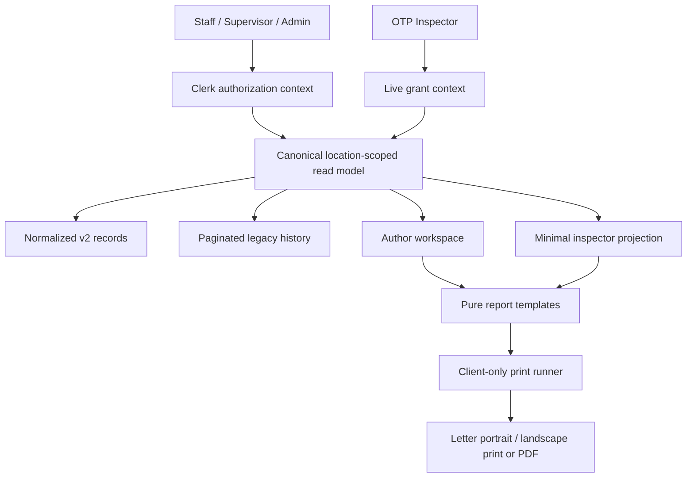
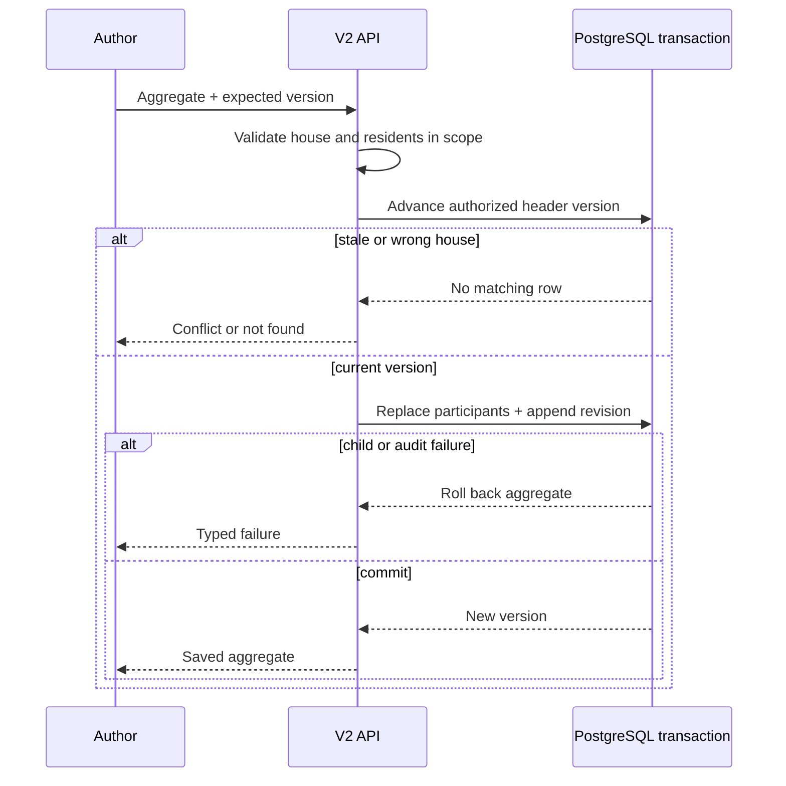

# feat: Match life-safety reporting templates

## Summary

Replace the current row-based life-safety forms with house-and-year workspaces that capture the fields in the supplied inspection and fire-drill templates, generate faithful Letter-size printouts, preserve legacy records, and present the same information to state inspectors.

---

## Problem Frame

The current system records a smoke and CO status in one monthly row and records one resident per fire-drill row. It has no fire-extinguisher data, evacuation duration, multi-staff attendance, annual-grid view, or printable life-safety report. The photographed forms instead organize inspections by house, year, month, and equipment category, and organize two fire-drill events with several resident results on one sheet.

Existing records also mix operational facts with audit metadata: routes replace the actual event date, time, initials, and staff with the submission timestamp and current Clerk user. The replacement must record what happened while continuing to derive `createdBy` and `updatedBy` on the server.

---

## Requirements

### Inspection records

- R1. A user selects one house and year and sees January through December with independent test or inspection dates and staff initials for smoke detectors, CO detectors, and fire extinguishers.
- R2. Each equipment category can be completed or corrected independently without creating more than one active entry for the same house, year, month, and category; voided history does not block a replacement active entry.
- R3. Digital author and inspector views retain outcome and notes fields even though the photographed print template displays only dates and initials.

### Fire-drill records

- R4. A fire-drill event stores house, year, sequence, actual local date and time, all staff present, and one or more resident results containing a resident reference when available, a required name snapshot, gathering duration, and comments.
- R5. Sequence `1` fills the printed **Semi-Annual Drill** section and sequence `2` fills the printed **Annual Drill** section; a missing sequence remains visibly blank.
- R6. Resident results remain historically readable from their required snapshots after a resident is renamed, transferred, made inactive, or deleted from the active roster.

### Templates and access

- R7. The inspection output matches the supplied portrait form: El Elyon Properties LLC branding, house and year, twelve month rows, and the three two-column equipment groups.
- R8. The fire-drill output matches the supplied landscape form: El Elyon Properties LLC branding, both drill sections, date/time, staff present, four resident columns per page, gathering minutes/seconds, and comments.
- R9. Staff, supervisors, and admins can author records only for authorized houses; OTP inspectors can read and print a minimal, non-cacheable projection for only the house granted by their session.
- R10. Existing smoke/CO and fire-drill rows remain available as read-only legacy history with their original dates, statuses, initials, staff, residents, and notes or comments.
- R11. New writes use centralized server and database validation, preserve operational facts separately from audit actors, reject duplicate identities and stale overwrites, record revisions, and save fire-drill headers plus residents atomically.
- R12. Print generation escapes record values, waits for fonts and branding assets, prevents duplicate print jobs, and cleans up its hidden document after success or failure.

---

## Scope Boundaries

### Included

- Replace the life-safety authoring workspace used by care, supervisor, and admin portals.
- Add the normalized storage and API contracts required by both photographed forms.
- Add faithful browser Print / Save as PDF output and inspector parity.
- Repair location authorization on every touched list, detail, mutation, resident-selection, and inspector path.
- Add a runnable `tsx`/`node:test` command plus isolated PostgreSQL integration coverage because the repository currently has one TypeScript test file but no executable test script.

### Deferred to Follow-Up Work

- Removing the legacy tables and compatibility endpoints after production data has been reviewed.
- A general report designer, configurable organization branding, or additional compliance-form types.
- Automated native print-dialog testing; the checked-in coverage will test pure templates and print orchestration, with a manual Chromium preview as the final fidelity gate.

---

## Key Technical Decisions

- **Use additive v2 tables and explicit legacy routes:** Current fire-drill rows cannot be grouped into events truthfully, and multiple smoke/CO rows may exist for a month. New normalized records become authoritative for the photographed forms; the current smoke and fire-drill routes become paginated GET-only legacy contracts, and distinct v2 routes prevent row DTOs from being confused with event aggregates.
- **Use stable house identities with display snapshots:** V2 rows reference `locations.id` and retain a server-derived house-name snapshot for historical and printed labels. Renaming a house must not split its history, while deleting a referenced house is restricted.
- **Model inspection categories as independent entries:** A named unique house/year/month/equipment constraint lets smoke, CO, and extinguisher work be recorded on different dates and prevents one category update from overwriting another.
- **Model fire drills as a header with participant children:** Event-level date/time and an ordered, deduplicated staff-name snapshot array belong on the header. Participant rows hold a nullable resident reference, required name snapshot, duration, comment, and position; roster-linked names are derived by the server, while explicitly permitted unlinked or external names are bounded, validated, and stored with their provenance. Only deletion of the header cascades to participants.
- **Keep sequence as a fixed reporting slot:** Sequence `1` prints as “Semi-Annual Drill” and sequence `2` as “Annual Drill.” Labels derive from sequence, but no Jan-Jun/Jul-Dec date rule is introduced because the current API and database do not enforce one.
- **Store operational dates as local calendar values:** PostgreSQL `date` and `time without time zone` values cross the API as canonical local strings, while audit timestamps remain server timestamps. Database and API checks require dates to agree with the selected reporting year and month.
- **Preserve outcomes outside the paper template:** Continue capturing constrained outcome and notes fields for smoke, CO, and extinguisher entries, but omit them from the faithful print layout.
- **Allow more than four residents without truncation:** Render resident results in ordered groups of four. The first page matches the photographed combined sheet; overflow uses continuation pages that repeat the relevant drill heading and table labels.
- **Make corrections auditable and removal non-destructive:** V2 records use a versioned revision entry for every create, correction, move, and void. User-facing removal marks the record void with actor, time, and reason; hard deletion is reserved for a transaction rollback or verified empty-data cleanup.
- **Separate pure rendering from browser orchestration:** Pure data-to-HTML builders stay DOM-free and testable. A client-only helper owns the hidden iframe, asset readiness, `print()`, `afterprint`, fallback cleanup, and in-flight guard, following the existing incident-report pattern and current [Next.js Client Component](https://nextjs.org/docs/app/getting-started/server-and-client-components), [React event-handler](https://react.dev/learn/synchronizing-with-effects), and [MDN printing](https://developer.mozilla.org/en-US/docs/Web/CSS/Guides/Media_queries/Printing) guidance.
- **Share a canonical report projection, not author DTOs:** Clerk routes and OTP inspector queries use common query/mutation modules and a DB-free report mapper. Inspector responses omit audit actors and unnecessary internal IDs, derive house scope only from the live grant, and return `Cache-Control: private, no-store`.
- **Enforce access inside query predicates:** Non-admin queries always include the caller’s allowed house IDs; omitted house, `all`, an empty assignment list, and out-of-scope IDs fail closed. Detail and mutation predicates include both record ID and authorized current house, while moves also authorize the destination without disclosing cross-house existence.
- **Use integer compare-and-swap versions:** Every v2 update, move, or void supplies `expectedVersion`; the database predicate advances the version atomically or returns a conflict. A drill edit advances the header version before replacing participants in the same transaction, so a stale request cannot change children.
- **Use a concrete focused test harness:** Add `tsx` to execute the existing `node:test` style, inject the browser-print adapter for DOM lifecycle tests, and run schema/transaction tests against an isolated PostgreSQL database that refuses the production connection string.

---

## High-Level Technical Design

---

## Implementation Units

### U1. Add normalized life-safety storage and compatibility contracts

- **Goal:** Introduce truthful v2 storage without rewriting or discarding ambiguous legacy records.
- **Requirements:** R1-R6, R10-R11.
- **Dependencies:** None.
- **Files:** `db/schema.ts`, `drizzle/0010_add_life_safety_reporting_v2.sql`, `lib/life-safety-reporting.ts`, `lib/life-safety-reporting.test.ts`, `db/life-safety.integration.test.ts`, `package.json`.
- **Approach:** Add inspection entries, fire-drill headers, participant children, and append-only revision rows. Use `locationId` plus a house-name snapshot; retain nullable resident references with `ON DELETE SET NULL` plus required name snapshots. Name unique, check, and foreign-key constraints for deterministic error mapping. Enforce month/equipment/sequence/date identities, duration pairs, positions, audit fields, active-row uniqueness, and integer versions in PostgreSQL as well as Zod. Do not backfill or rewrite legacy rows; keep both legacy tables byte-for-byte intact. Add `tsx` for focused tests and an isolated PostgreSQL integration target for real constraint and transaction behavior.
- **Patterns to follow:** Drizzle schema/index conventions in `db/schema.ts`; reviewed SQL migrations in `drizzle/`; audit fields on the existing life-safety tables.
- **Test scenarios:**
  - Accept one smoke, CO, and extinguisher entry for the same house/year/month because equipment type is part of the identity.
  - Reject a duplicate active house/year/month/equipment entry and a duplicate active house/year/sequence drill header while allowing a voided identity to be replaced.
  - Reject a duplicate participant or position, a half-null duration, negative minutes, seconds outside `0-59`, and a null duration without an explanatory comment.
  - Preserve house, resident, and staff snapshots after source records are renamed; a resident deletion nulls only the reference, while a referenced house cannot be deleted.
  - Void a drill without deleting its participants, append the matching revision, and allow hard cascade only inside a rolled-back create or verified empty-data cleanup.
  - Apply the migration to clean and populated test databases and prove every legacy row and content fingerprint is unchanged.
  - Exercise database uniqueness, checks, foreign keys, and transaction rollback through the isolated PostgreSQL test target.
- **Verification:** Generated SQL is additive and fully constrained before v2 writers are enabled, legacy content is unchanged, v2 invariants fail at the database boundary, and both focused test targets run through committed package scripts.

### U2. Replace drifted validation and secure the API boundary

- **Goal:** Make the API accept the photographed-form data while enforcing authorization, validation, transactions, and conflicts consistently.
- **Requirements:** R1-R6, R9-R11.
- **Dependencies:** U1.
- **Files:** `lib/validation-schemas.ts`, `lib/db-helpers.ts`, `lib/life-safety-reporting.ts`, `db/queries/life-safety.ts`, `db/mutations/life-safety.ts`, `src/app/api/documents/life-safety-inspections/route.ts`, `src/app/api/documents/life-safety-inspections/[id]/route.ts`, `src/app/api/documents/fire-drill-reports/route.ts`, `src/app/api/documents/fire-drill-reports/[id]/route.ts`, `src/app/api/documents/fire-drills/route.ts`, `src/app/api/documents/fire-drills/[id]/route.ts`, `src/app/api/documents/smoke-detector-checks/route.ts`, `src/app/api/documents/smoke-detector-checks/[id]/route.ts`, `src/app/api/documents/life-safety-residents/route.ts`, `src/app/api/documents/life-safety-api.test.ts`, `db/life-safety.integration.test.ts`.
- **Approach:** Replace the unused life-safety Zod shapes with bounded create/update/query contracts and canonical report DTOs. Put canonical reads and transactional mutations in the repository’s `db/queries` and `db/mutations` layers so Clerk and OTP routes cannot drift. New inspection and fire-drill-report routes serve v2 aggregates; current smoke and fire-drill routes become cursor-paginated GET-only legacy contracts whose mutation methods reject writes. A life-safety-specific resident picker preserves the unrelated current-shift behavior of `src/app/api/care/residents/route.ts`. Authorize house scope inside every query predicate, derive all house/resident snapshots and audit actors server-side, require JSON and bounded bodies, and use integer compare-and-swap updates. A drill transaction advances the authorized header version before replacing the complete participant set and appending its revision; any failure rolls back the version, children, and revision together.
- **Patterns to follow:** Query/mutation separation under `db/queries/` and `db/mutations/`; `requireCareAccess` in `lib/db-helpers.ts`; collection and record route structure under `src/app/api/documents/`; Zod definitions in `lib/validation-schemas.ts`.
- **Test scenarios:**
  - An admin can query any known house; a scoped user can query an assigned house only, and unknown house IDs cannot create orphan records.
  - Covers AE2. An explicit unauthorized house, unauthorized record ID, requested move, omitted house, `all`, or empty non-admin assignment fails closed without revealing whether a cross-house record exists.
  - A record move authorizes both the current and destination houses in the mutation predicate; a concurrent move causes zero rows to match.
  - A House A drill containing a House B resident rolls back for both scoped users and admins; saved name snapshots come from the House A roster rather than the client.
  - Inspection category updates are partial and do not clear sibling categories.
  - A fire-drill save commits the version, header, participants, and revision or rolls back the whole request.
  - Two creates for one natural identity produce one record and one conflict; two edits from the same version produce one commit and one unchanged stale aggregate.
  - Year/month/sequence mismatches, duplicate residents, invalid durations, and unrecognized payload properties are rejected by the shared schema.
  - Legacy POST, PATCH, and DELETE calls cannot change either legacy table; paginated GET returns one lossless DTO per legacy row within authorized scope.
  - Unsupported content types and oversized aggregate bodies are rejected without logging resident names, comments, or full payloads.
- **Verification:** Every route delegates to the canonical query/mutation boundary, authorization is part of each database predicate, legacy routes cannot write, and injected transaction failures leave the prior aggregate and revision state unchanged.

### U5. Generate the two photographed print templates

- **Goal:** Produce physically faithful, safe, and deterministic browser printouts from normalized report data.
- **Requirements:** R5, R7-R8, R12.
- **Dependencies:** U2.
- **Files:** `src/components/shared/printDocument.ts`, `src/components/shared/printDocument.test.ts`, `src/components/supervisor/printLifeSafetyReports.ts`, `src/components/supervisor/printLifeSafetyReports.test.ts`, `src/components/care/printIncidentReport.ts`.
- **Approach:** Extract the hidden-iframe lifecycle from `printIncidentReport.ts` into a client-only runner with an injected browser adapter, while leaving HTML generation pure. Build a portrait Letter inspection template and landscape Letter fire-drill template from the canonical report projection, using the supplied organization name, a fixed trusted logo URL, fixed table geometry, print-only CSS, physical units, and modern fragmentation rules with legacy aliases. Record values may enter bounded text slots only and receive context-appropriate encoding; the standalone document carries a restrictive meta CSP. Wait for iframe load, fonts, and image decode; register idempotent `afterprint` and fallback cleanup before printing. Chunk resident results four per page and repeat the applicable headings on continuation pages.
- **Patterns to follow:** Escaping and hidden-iframe behavior in `src/components/care/printIncidentReport.ts`; [MDN `@page`](https://developer.mozilla.org/en-US/docs/Web/CSS/Reference/At-rules/@page), [MDN `break-inside`](https://developer.mozilla.org/en-US/docs/Web/CSS/Reference/Properties/break-inside), and [OWASP output encoding](https://cheatsheetseries.owasp.org/cheatsheets/Cross_Site_Scripting_Prevention_Cheat_Sheet.html).
- **Test scenarios:**
  - Inspection HTML contains Jan-Dec exactly once, all three equipment groups, the selected house/year, and `size: Letter portrait`.
  - Fire-drill HTML labels sequences correctly, renders a blank missing section, lays out four residents per page, and uses `size: Letter landscape`.
  - Covers AE5. Five or more residents create a continuation page without dropping or duplicating a resident.
  - Long names, multiline comments, ampersands, quotes, and HTML-like input remain escaped and do not produce literal `null` or `undefined`.
  - Tag-closing, quote-breaking, event-handler, `javascript:`, CSS-closing, and attacker URL payloads create no new element, attribute, style rule, or outbound resource.
  - Only fixed template assets appear in resource-bearing attributes, and oversized comments, staff arrays, or participant collections are rejected before rendering.
  - A second click during an active print is ignored; load/font/image failure cleans up the iframe and reports an error instead of printing stale content.
  - Existing incident printing still opens through the extracted runner and preserves its output.
- **Verification:** Pure tests validate content and pagination, and Chromium Print Preview at 100% scale with browser headers/footers disabled shows a one-page portrait inspection sheet and a one-page landscape fire-drill sheet for up to four residents per section.

### U3. Build the annual inspection authoring workspace

- **Goal:** Let authorized users maintain the twelve-month inspection sheet directly from the shared life-safety workspace.
- **Requirements:** R1-R3, R7, R9-R11.
- **Dependencies:** U2, U5.
- **Files:** `src/components/supervisor/LifeSafetyDocuments.tsx`, `src/components/supervisor/LifeSafetyInspectionWorkspace.tsx`, `src/components/supervisor/lifeSafetyInspectionModel.ts`, `src/components/supervisor/lifeSafetyInspectionModel.test.ts`.
- **Approach:** Leave `LifeSafetyDocuments.tsx` as the tab shell and move the annual inspection behavior into a focused workspace. Require a stable house ID and year, show Jan-Dec rows with independent smoke, CO, and extinguisher editors, and send the current integer version with corrections or voids. Default initials from the signed-in user but keep them editable as event facts. Retain outcome/notes in an expandable detail editor, surface incomplete months without treating blanks as failures, and load all cursor pages of clearly labeled read-only legacy history.
- **Patterns to follow:** Existing location-loading fallback and modal/table styling in `LifeSafetyDocuments.tsx`; server-derived audit behavior in the current routes.
- **Test scenarios:**
  - Covers AE1. Saving January smoke first and adding January CO and extinguisher later produces three entries in one month row without duplicates or cleared values.
  - A missing month renders three blank category cells and is distinguishable from a failed inspection.
  - Correcting an actual date or initials does not change the server-derived audit actor.
  - Two open editors receive a conflict for the stale save and preserve the first committed correction.
  - Covers AE3. A legacy failed smoke or CO check remains visible with its original status, date, initials, and notes; multiple legacy checks in one month remain separate.
  - The print action is disabled until exactly one house and one year are selected.
- **Verification:** Users can complete categories in any order, all twelve months remain visible, and no legacy action is presented as editing a v2 entry.

### U4. Build event-centric fire-drill authoring

- **Goal:** Capture one complete sequence event with staff and resident evacuation results instead of one submission per resident.
- **Requirements:** R4-R6, R8-R11.
- **Dependencies:** U2, U5.
- **Files:** `src/components/supervisor/LifeSafetyDocuments.tsx`, `src/components/supervisor/FireDrillWorkspace.tsx`, `src/components/supervisor/fireDrillModel.ts`, `src/components/supervisor/fireDrillModel.test.ts`.
- **Approach:** Leave `LifeSafetyDocuments.tsx` as the tab shell and present sequence 1 and sequence 2 as two event slots in a focused workspace. Each editor captures actual date/time, an ordered deduplicated staff-name list, and an ordered resident list with duration and comments. The client submits roster IDs when available or explicitly permitted bounded names with provenance; the server derives snapshots for linked IDs and validates unlinked or external names. Prevent duplicate residents, allow an explanatory comment with blank duration for a resident who did not reach the gathering place, load all legacy pages, and void a report with a required reason instead of deleting its compliance facts.
- **Patterns to follow:** Shared workspace composition in `LifeSafetyDocuments.tsx`; life-safety-specific authorized resident selection; existing confirmation styling adapted to display sequence, participant count, and void reason.
- **Test scenarios:**
  - Covers AE4. Saving sequence 1 with residents leaves sequence 2 absent and printable as a blank Annual section.
  - A renamed, transferred, or inactive resident continues to display the saved snapshot on the historical report.
  - A participant may have `0` minutes and valid seconds, while negative values and `60` seconds are rejected.
  - A resident without a recorded gathering time requires a comment explaining the missing duration.
  - Editing event details retains participants; a stale edit cannot replace them.
  - Voiding the event names its sequence and participant count, requires a reason, and preserves the header, participants, and revision history.
- **Verification:** One save produces one header and its ordered participant set, and authoring never substitutes the submission time or current user for the recorded facts.

### U6. Bring the inspector and portal surfaces into parity

- **Goal:** Show state inspectors the same normalized records, legacy history, and print actions without widening their access.
- **Requirements:** R3, R5-R10, R12.
- **Dependencies:** U2, U5.
- **Files:** `db/queries/inspector.ts`, `src/app/api/inspector/overview/route.ts`, `src/components/inspector/InspectorDashboard.tsx`, `src/components/inspector/lifeSafetyPresentation.ts`, `src/components/inspector/lifeSafetyPresentation.test.ts`, `src/components/care/CarePortal.tsx`, `src/components/admin/AdminPortal.tsx`, `src/components/shared/Sidebar.tsx`.
- **Approach:** Pass the validated live OTP grant into the canonical read model; never accept a house from inspector query, body, or headers. Return an allowlisted report projection plus paginated legacy history, omitting Clerk audit IDs and unnecessary resident identifiers, and mark the response `private, no-store`. Replace the two simple tables with annual read-only views and the shared template builders. Keep mutation controls absent and update navigation copy to name fire drills and life-safety inspections accurately.
- **Patterns to follow:** OTP session scoping in `db/queries/inspector.ts` and tab composition in `src/components/inspector/InspectorDashboard.tsx`.
- **Test scenarios:**
  - An inspector grant returns normalized and legacy records for its house only, even if another house is supplied by the client.
  - Revoked or expired sessions fail before any report query, and cross-house child or legacy fixtures cannot enter through joins.
  - Inspector JSON omits `createdBy`, `updatedBy`, Clerk IDs, and unnecessary resident UUIDs and includes the non-cacheable response policy.
  - Inspector inspection rows group by year/month/equipment without hiding legacy failures or notes.
  - Inspector fire-drill presentation preserves sequence labels, staff list, participant order, name snapshots, and blank durations.
  - Inspector and author surfaces share the minimal report projection and template builders, not the broader author mutation DTO.
  - Care, admin, and sidebar navigation still open the shared workspace after label changes.
- **Verification:** Author and inspector output for the same house/year contain the same recorded facts, while inspector controls remain read-only and location-bound.

---

## Acceptance Examples

- AE1. Given January has only a smoke entry, when the user later saves CO and extinguisher details, then the January row contains all three categories with their original independent dates and initials.
- AE2. Given a non-admin is assigned to House A, when they request House B through a filter, record ID, resident query, or mutation body, then the request is rejected before any House B data is read or changed.
- AE3. Given two legacy smoke/CO checks exist in the same month and one failed, when the v2 workspace opens, then both remain visible in legacy history and neither is silently collapsed or marked as a v2 entry.
- AE4. Given a year contains sequence 1 but no sequence 2 fire drill, when the combined sheet is printed, then the Semi-Annual section is populated and the Annual section is present but blank.
- AE5. Given a drill contains more than four resident results, when it is printed, then every resident appears once across a faithful first page and labeled continuation pages.
- AE6. Given an operational date is entered near midnight, when it appears in author, inspector, and print views, then it retains the selected local calendar day, month, and year.

---

## System-Wide Impact

- **Data lifecycle:** New tables become the write model; legacy tables stay byte-for-byte available through GET-only routes until a separately reviewed retirement plan. V2 corrections and voids retain snapshots and append a same-transaction revision instead of erasing compliance facts.
- **Authorization:** Query predicates now fail closed for omitted, `all`, empty, unknown, and out-of-scope houses. All portals must handle forbidden or not-found responses without retrying unscoped, and v2 writer enablement must coincide with legacy write shutdown.
- **Inspector contract:** The overview response changes to a minimal, non-cacheable report projection plus explicit legacy collections. The dashboard must deploy with the canonical read model and cannot reuse author mutation DTOs.
- **Concurrency:** Inspection categories can be edited independently; fire-drill aggregates use an integer header version, transactional participant replacement, and atomic revision writes.
- **Roster lifecycle:** House, resident, and staff names are historical snapshots. Roster deletion must not cascade into compliance history, and snapshot data remains protected by the same house authorization and retention policy.
- **Branding and assets:** The print runner must wait for `public/logo.svg` or `public/logo-source.png` to load before opening the dialog.

---

## Risks and Mitigations

- **Legacy grouping is unknowable:** Keep legacy rows separate and read-only; do not infer shared events or collapse duplicate months.
- **Legacy write bypass remains callable:** Convert both current collection/detail route pairs to GET-only legacy contracts in the same release that enables v2 writes, and cover direct mutation attempts with contract tests.
- **House scope can be omitted from a query or join:** Require authorization context in canonical queries and include authorized house IDs in list, detail, mutation, participant, and legacy predicates.
- **Cross-house residents can contaminate a drill:** Resolve all submitted resident IDs against the event house inside the transaction and derive snapshots server-side, including for admins assigned to both houses.
- **Legacy pagination can hide old facts:** Use cursor pagination with totals and make the annual author/inspector views load all pages for the selected house/year.
- **Print settings can override CSS:** Specify Letter size and orientation in `@page`, use physical dimensions, and verify the supported Chromium workflow with 100% scale and headers/footers disabled.
- **Long values can break fixed geometry:** Test maximum practical house, staff, and resident names; wrap or reduce text within bounded cells and paginate participant overflow.
- **Raw HTML creates an injection boundary:** Centralize escaping and never interpolate report values into style, script, tag-name, or event-handler contexts.
- **Inspector output can be cached or overexposed:** Derive scope only from the live grant, return an allowlist DTO, omit audit/internal IDs, and send `private, no-store`.
- **Schema and validation already drift:** Make the new Zod DTOs the imported server contract and delete or replace stale names in the same unit.
- **Aggregate requests can exhaust or confuse parsers:** Require bounded JSON DTOs and return typed errors without logging record contents.
- **Migration locks or rollback can strand v2 facts:** Create the empty v2 tables with final named constraints before writers are enabled, use short migration timeouts, and roll back by disabling v2 writes while retaining any v2 data. Use reviewed migrations rather than `db:push`, following [Drizzle’s migration workflow](https://orm.drizzle.team/docs/migrations) and [PostgreSQL `ALTER TABLE`](https://www.postgresql.org/docs/current/sql-altertable.html) guidance.

---

## Documentation and Operational Notes

- Document the new life-safety payloads and the distinction between operational facts, audit actors, normalized records, and legacy history near the API contracts.
- Document null semantics, sequence labels, local date/time rules, snapshot behavior, full drill replacement, version conflicts, corrections, and voiding in the data dictionary.
- Before rollout, take a recoverable backup and capture legacy counts by house/year plus a deterministic content fingerprint; verify the old application can still read the untouched legacy tables after migration.
- Apply and verify the fully constrained empty v2 schema before enabling writers; test it against a clean database and a populated production-like copy. Do not combine this feature with a Drizzle upgrade.
- Deploy the canonical backend and both author/inspector clients before enabling v2 writes. Roll back by disabling v2 writes and retaining v2 read/export access; never drop non-empty v2 tables.
- After deployment, verify one authorized and one forbidden house for staff access, then verify an OTP inspector session for a single house.
- Monitor unique violations, version conflicts, failed transactions/revisions, orphan participants, legacy/v2 read errors, and record counts by house/year before widening rollout.
- Complete two manual Chromium Save as PDF checks: Letter portrait for the annual inspection sheet and Letter landscape for the fire-drill sheet.

---

## Sources and Research

- `src/components/supervisor/LifeSafetyDocuments.tsx` — current shared authoring UI and data flow.
- `db/schema.ts` and `drizzle/0001_add_life_safety_tables.sql` — current life-safety records and indexes.
- `src/app/api/documents/smoke-detector-checks/route.ts` and `src/app/api/documents/fire-drills/route.ts` — current auto-populated facts and location filters.
- `db/queries/inspector.ts` and `src/components/inspector/InspectorDashboard.tsx` — state-inspector read path.
- `src/components/care/printIncidentReport.ts` — established escaped hidden-iframe print pattern.
- `PHASE_2_COMPLETE.md` — centralized validation direction and the existing life-safety schema backlog.
- [MDN: Printing](https://developer.mozilla.org/en-US/docs/Web/CSS/Guides/Media_queries/Printing) and [Window.print](https://developer.mozilla.org/en-US/docs/Web/API/Window/print) — current browser print lifecycle.
- [PostgreSQL: ALTER TABLE](https://www.postgresql.org/docs/current/sql-altertable.html) — additive migration and constraint behavior.
