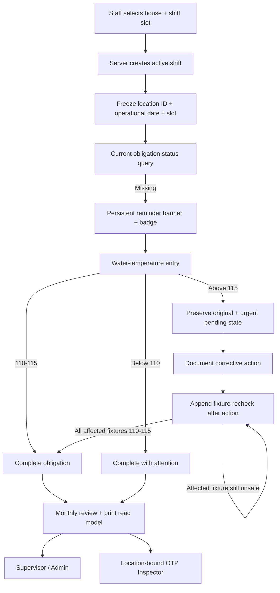
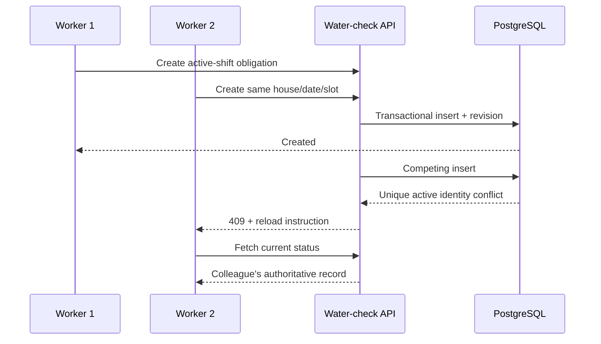

# feat: Add daily water-temperature checks by shift

## Summary

Add a house-scoped Daily Water Temperature Check Log that creates one compliance obligation for each operational day and fixed 1st, 2nd, and 3rd shift. Staff select the shift slot while clocking in, receive a persistent in-app reminder until that slot is complete, record kitchen and bath/shower temperatures, and document corrective action plus safe rechecks when a reading exceeds 115°F.

Supervisors and admins receive a monthly review, correction, audit, and print workspace. OTP inspectors receive the same operational facts and landscape report through a location-bound read-only projection. The printed output follows the supplied form: rows 1–31, grouped columns for three shifts, a daily comments/action column, the 110–115°F guidance, and the escalation/recheck footer.

The statements printed on the photographed form are treated as product requirements and report copy. They are not instructions for the implementation agent to perform any real-world safety action.

---

## Problem Frame

The application can clock a user in at a named location, but a shift currently has no 1st/2nd/3rd slot, immutable location ID, or frozen operational date. That means the system cannot reliably decide which daily water-temperature obligation is due, especially for overnight shifts.

The repository also has email-oriented compliance alerts, but they are the wrong source of truth for this feature. The reminder must reflect whether the canonical house/day/shift record is complete and must clear for every active worker as soon as another authorized worker completes it. Creating a notification row on every page load would duplicate state and could leave stale reminders.

Finally, an unsafe reading must be saved as an operational fact. The application must not reject or overwrite a value above 115°F merely because it is unsafe. It must preserve the original observation, guide staff through corrective-action documentation, accept repeated append-only rechecks, and keep the urgent reminder active until every affected fixture has a safe 110–115°F follow-up.

---

## Requirements

### Shift identity and obligation

- **R1.** Every new clock-in requires an authorized house and a fixed shift slot of `1`, `2`, or `3`; the server stores an immutable location ID, house-name snapshot, selected slot, and operational date on the shift.
- **R2.** The operational date and timezone used are frozen at clock-in from the configured organization timezone. A shift that crosses midnight retains its start date, and a later timezone change, browser locale, or database host timezone cannot change historical obligation identity.
- **R3.** At most one active water-temperature check exists for a house, operational date, and shift slot. The obligation is shared by staff working the same slot rather than duplicated per employee or clock-in record.

### Recording and safety workflow

- **R4.** A staff entry records required kitchen and bath/shower Fahrenheit readings to one decimal place, the associated shift, server-derived staff ID/name/initial snapshots, observation time, and optional comments/notes.
- **R5.** Values from 110°F through 115°F are safe. Values below 110°F are retained as `complete_with_attention` and visibly flagged but, under the approved scope, do not require the above-115 corrective workflow or persistent reminder.
- **R6.** If either initial reading is above 115°F, the original reading is saved immediately and the obligation remains incomplete. The interface presents the form’s instructions, requires documented action, and accepts append-only rechecks for each affected fixture until its latest recheck is within 110–115°F.
- **R7.** A later safe recheck never replaces the original unsafe reading. Digital views and print comments preserve the affected fixture, original result, action taken, and ordered recheck chain with actor and time snapshots.

### Reminder and staff experience

- **R8.** After clock-in, the Care Portal derives `due`, `action_required`, `recheck_required`, `complete`, `complete_with_attention`, or `unknown` from the active shift and canonical record. A non-dismissible banner, navigation badge, and direct action remain visible across portal views, reloads, and app refocus until the obligation is complete; `complete_with_attention` clears the staff reminder while remaining visible to management.
- **R9.** Reminder failures fail visibly as “unable to verify” with retry; they never appear complete by default. Successful creation, action, recheck, correction, or void triggers an authoritative refetch so every open client converges on current state.
- **R10.** Clock-out warns when the obligation is missing or an unsafe response is unresolved but remains allowed. The unresolved house/day/slot stays visible to supervisors and to replacement staff clocking into that same obligation.

### Review, audit, print, and access

- **R11.** Staff writes are append-only: they may create the obligation derived from their active shift and add their own action/recheck facts, but may not edit, backdate, void, overwrite, or inherit another worker’s identity. Supervisors may manage only currently authorized houses; admins use the canonical admin check. Their reasoned corrections, recheck supersessions, voids, and missing-slot entries use optimistic concurrency and append-only revision snapshots.
- **R12.** The monthly digital workspace distinguishes valid-day missing, pending action, pending recheck, complete, below-range flagged, voided-history, future, and nonexistent calendar-day states.
- **R13.** The landscape Letter report includes organization branding, house, month/year, the 110–115°F guidance, days 1–31, three grouped shift sections with Kitchen/Bath-Shower/Initials, one Comments/Notes/Action Taken column, and the source form’s above-115 escalation/recheck footer.
- **R14.** Nonexistent dates in February and 30-day months are marked N/A and never treated as missing obligations. Valid but unrecorded dates remain blank on paper and explicitly Missing in the digital supervisor view.
- **R15.** OTP inspectors can select a month/year, view, and print active records for only the immutable location in their live session. The allowlist includes the initials and action/recheck narrative required by the supplied report, but excludes full staff names, internal actor/shift/record IDs, auth metadata, voids, and revision history. Inspector responses are read-only and return `Cache-Control: private, no-store`.
- **R16.** All author and inspector queries fail closed on omitted, ambiguous, inactive, or unauthorized locations; client-supplied location/date/slot values cannot widen an active staff shift or inspector grant.
- **R17.** Duplicate submissions and retries use idempotency identifiers plus database uniqueness; stale corrections/rechecks and races with void or clock-out return typed conflict/recovery states without losing the winning compliance record or the user’s entered values.
- **R18.** Every detail, child, mutation, month, print, and inspector query includes authorized `locationId` in its database predicate, returns the same not-found response for absent and unauthorized IDs, revalidates role/location/active-shift state inside the write transaction, and prevents authenticated responses from entering shared browser/service-worker caches.

---

## Scope Boundaries

### Included

- Required 1st/2nd/3rd shift selection in the existing clock-in and selfie flows.
- A server-derived organization-local operational date frozen on the shift.
- Normal, below-range, above-115 corrective-action, and repeated-recheck workflows.
- A persistent in-app banner, badge, CTA, refresh-on-focus, and bounded polling while the app is open.
- Staff entry plus supervisor/admin monthly review, correction, void, audit history, and print.
- Read-only inspector month/year view and the same printable report.
- Additive database migration, strict validation, authorization, concurrency controls, and focused tests.

### Deferred to Follow-Up Work

- Physical thermometer, Bluetooth, Wi-Fi, or other automated sensor integration.
- Browser push, SMS, or email reminders while the app is closed.
- Automatically blocking clock-out or payroll processing when a check is incomplete.
- Configurable per-house shift schedules or automatic slot inference from clock-in time.
- Per-house timezones; the initial design uses one explicit organization operating timezone.
- Historical backfill from paper forms beyond a supervisor/admin reasoned manual entry.

---

## Key Technical Decisions

- **KTD1 — Select the slot; do not infer it:** The codebase has no scheduled-shift model or authoritative time boundaries. Add a required 1st/2nd/3rd choice to clock-in and persist it on the shift. The selfie path must preserve both house and slot while capture is open.
- **KTD2 — Freeze the business date and timezone snapshot:** Configure one organization operating timezone, initially `America/Chicago`, in one canonical setting rather than scattering a literal through queries. At clock-in, store both the computed `operationalDate` and timezone snapshot on the shift/check. Overnight and daylight-saving behavior remain historical facts even after configuration changes. Per-house timezones are explicitly rejected for this release; multi-timezone operation would require location-level configuration first.
- **KTD3 — Make the obligation house/day/slot scoped:** A partial unique active index on `(locationId, operationalDate, shiftSlot)` lets one worker satisfy the shared shift obligation, resolves concurrent submissions deterministically, and allows a voided record to be replaced.
- **KTD4 — Use one computed state machine and preserve every observation:** The non-writable state machine is `missing → complete | complete_with_attention | action_required → recheck_required → complete`. Action must be documented before rechecks. Every fixture initially above 115°F needs a latest active recheck in 110–115°F; another unsafe recheck appends a fact and remains/reopens pending. Staff-submitted originals and rechecks are immutable. A privileged correction or recheck supersession appends reasoned before/after history and atomically recomputes state; monthly/print views continue to show the original unsafe observation rather than substituting the later safe result.
- **KTD5 — Keep reminders derived, stateful, and non-dismissible:** The active-shift status endpoint projects missing, action-due, fixture-specific recheck-due, complete-with-attention, or complete from the canonical state machine. “Non-dismissible” means persistently visible, not a block on unrelated work. Do not insert durable `complianceAlerts` rows; those belong only to a future push/inbox feature. Refresh after app bootstrap, clock-in, relevant writes, focus/visibility, and a bounded poll so a duplicate-create conflict can reload as “completed by another staff member.”
- **KTD6 — Separate append-only staff facts from privileged correction:** Staff identity and initials are server-derived and read-only; replacement staff append under their own snapshots and never inherit the first worker’s initials. Staff are constrained to an active authorized shift and cannot change existing facts. Supervisor/admin manual entries, corrections, recheck supersessions, and voids require fresh role/location authorization, a reason, expected version, and before/after revision. Voiding reopens the obligation instead of deleting history.
- **KTD7 — Treat below and above range differently:** Both are visibly outside 110–115°F. Below 110°F becomes `complete_with_attention` because the supplied form mandates resident-use restriction/escalation specifically above 115°F; the rejected alternative is applying the high-temperature workflow symmetrically without a product policy basis. Above 115°F remains urgent until action and a safe latest active recheck exist for every affected fixture.
- **KTD8 — Reuse report plumbing, not author DTOs:** Reuse the existing pure HTML/escape/hidden-iframe print runner and location authorization patterns. Give inspectors a minimal session-scoped projection rather than exposing author mutation or revision payloads.
- **KTD9 — Put invariants behind one application boundary:** Clock-in orchestration consumes a narrow status interface; staff, management, reminder, print, and inspector routes share one water-temperature domain service/read model and do not reimplement state. Authorization revalidation, header lock/version advance, fact or revision append, state derivation, and audit write commit atomically. Every ID lookup includes the already-authorized location predicate.

---

## High-Level Technical Design

---

## Implementation Units

### U1. Add shift identity and normalized water-temperature storage

- **Goal:** Establish durable business identity, compliance facts, resolution history, and database invariants before exposing writes.
- **Requirements:** R1-R7, R11, R17-R18.
- **Dependencies:** None.
- **Files:** `db/schema.ts`, `drizzle/0011_add_daily_water_temperature_checks.sql` (new), `lib/water-temperature.ts` (new), `lib/water-temperature.test.ts` (new), `db/water-temperature.integration.test.ts` (new), `package.json`.
- **Approach:**
  - Add nullable `locationId`, `shiftSlot`, `operationalDate`, and `operationalTimeZoneSnapshot` columns to `shifts` for backward compatibility; constrain non-null slots to 1–3 and require the complete identity for every post-cutover clock-in.
  - Add one organization timezone field to `config`, validate it as an IANA timezone, and seed existing installations to `America/Chicago` while retaining an explicit configuration path.
  - Add `waterTemperatureChecks` with immutable location FK, house-name snapshot, operational date, slot, nullable associated shift ID, initial kitchen/bath readings, staff ID/name/initial snapshots, observation time, comments, action, derived resolution state, version, void metadata, and audit timestamps.
  - Use a partial unique index for one non-voided `(locationId, operationalDate, shiftSlot)` record and checks for slots, bounded Fahrenheit decimals, non-empty snapshots, valid version/state, and complete void metadata.
  - Add append-only `waterTemperatureRechecks` keyed to a check and fixture (`kitchen` or `bath_shower`) with reading, actor snapshots, measured time, deterministic sequence, and optional superseded/void metadata. State ignores superseded facts but history never updates or deletes them. Add `waterTemperatureCheckRevisions` with aggregate before/after snapshots and create/correct/action/recheck/supersede/void actions.
  - Use nullable/non-cascading staff and shift references plus immutable snapshots; restrict or soft-delete referenced locations so neither operational cleanup nor roster changes erase compliance history.
  - Treat 0–250°F as an input-valid thermometer range and derive operational safety separately so an out-of-range safety observation is recordable. Store one decimal without binary-floating-point identity comparisons.
- **Patterns to follow:** Stable location identity and snapshots in `db/schema.ts:845-917`; active-row uniqueness and revision snapshots in `db/schema.ts:871-884` and `db/schema.ts:1037-1087`; local-date validation in `lib/life-safety-reporting.ts:46-95`.
- **Test scenarios:**
  - Accept all three slots for the same house/date and reject a fourth active record that duplicates one slot.
  - Permit a replacement after void while retaining both historical rows and revisions.
  - Preserve the initial 118°F observation after one unsafe and one safe kitchen recheck.
  - Supersede a mistyped recheck with a reason, preserve both facts, and derive state from the latest active ordered recheck.
  - Reject invalid slots, nonnumeric/impossible temperatures, incomplete snapshots, and malformed void metadata without rejecting 108°F or 118°F safety observations.
  - Roll back the check/action/recheck aggregate if its revision write fails.
  - Retain records when a shift is later removed or a staff/house display name changes.
- **Verification:** The migration is additive for existing rows, constraints fail deterministically, and an isolated PostgreSQL integration test proves active uniqueness, FK behavior, revision retention, and transaction rollback.

### U2. Extend clock-in with a stable house, slot, and operational date

- **Goal:** Give every active shift enough server-owned context to address the correct water-temperature obligation.
- **Requirements:** R1-R3, R8, R10, R16-R18.
- **Dependencies:** U1.
- **Files:** `db/mutations/care.ts`, `db/queries/care.ts`, `src/app/api/shifts/clock-in/route.ts`, `src/app/api/shifts/current/route.ts`, `src/app/api/shifts/current/classify/route.ts` (new), `src/components/care/CareShiftWorkspace.tsx`, `src/components/care/CareShiftWorkspace.test.tsx` (new), `src/app/api/settings/app/route.ts`, `src/components/admin/SystemSettings.tsx`, `lib/operational-time.ts` (new), `lib/operational-time.test.ts` (new).
- **Approach:**
  - Require `shiftSlot` alongside the selected location in normal and selfie clock-in requests. Resolve the authorized active location name to its immutable ID on the server, snapshot its display name, and compute/store the local operational date plus timezone snapshot from the canonical organization setting in the same transaction.
  - Return a minimal current-shift DTO containing shift ID, location ID/name, slot, operational date, and clock-in time rather than exposing an unvalidated table row.
  - Add a one-time classification endpoint for an already-open legacy shift with null identity fields. It accepts one authorized slot, resolves the existing location name fail-closed, freezes the date from the original clock-in timestamp, and cannot be changed by staff after classification.
  - Preserve the selected house and slot while selfie capture is active and prevent double-submit. If the configuration timezone is absent or invalid, fail clock-in visibly rather than falling back to the browser or database timezone.
  - Add the timezone setting to the existing admin settings contract and UI without exposing it as a care-user choice.
- **Patterns to follow:** Clock-in lifecycle in `src/components/care/CareShiftWorkspace.tsx:57-99` and `140-189`; current shift state in `src/components/care/CarePortal.tsx:98-160`; fail-closed location resolution in `db/queries/life-safety.ts:45-99` and `137-187`.
- **Test scenarios:**
  - Normal and selfie clock-in persist the same selected house and slot.
  - Unauthorized, inactive, blank, or ambiguous locations fail before shift creation.
  - A 3rd shift starting at 11:30 PM retains its start date after midnight and through a daylight-saving transition.
  - A legacy open shift can be classified once; a second classification attempt conflicts.
  - An invalid/missing timezone produces an actionable error instead of a UTC or browser-local date.
- **Verification:** `/api/shifts/current` returns stable identity after reload, and no new active shift can exist without a resolvable location ID, slot, and operational date.

### U3. Build the canonical authorized write/read model and APIs

- **Goal:** Centralize validation, authorization, state derivation, concurrency, and reminder status for staff and management consumers.
- **Requirements:** R3-R12, R16-R18.
- **Dependencies:** U1, U2.
- **Files:** `db/queries/water-temperature.ts` (new), `db/mutations/water-temperature.ts` (new), `lib/validation-schemas.ts`, `src/app/api/documents/_water-temperature-route.ts` (new), `src/app/api/documents/water-temperature-checks/route.ts` (new), `src/app/api/documents/water-temperature-checks/[id]/route.ts` (new), `src/app/api/documents/water-temperature-checks/[id]/rechecks/route.ts` (new), `src/app/api/care/water-temperature-status/route.ts` (new), `src/app/api/documents/water-temperature-api.test.ts` (new).
- **Approach:**
  - Create strict, bounded Zod contracts and a route helper that caps JSON bodies, maps validation/auth/not-found/version/unique conflicts, and sets private non-cacheable responses.
  - Staff create requests derive location/date/slot and staff snapshots exclusively from the authenticated active shift. Revalidate at commit that the shift is open, the actor is still assigned, and its frozen identity matches; do not accept identity fields from staff payloads. An already-valid shift may finish after house deactivation, but no new clock-in may start there.
  - Derive status transactionally: safe initial readings complete; below-range readings become `complete_with_attention`; any fixture above 115 begins `action_required`; saved action advances to `recheck_required`; the latest active ordered recheck for every high fixture must be 110–115 before `complete`. A later active unsafe recheck reopens pending state.
  - Permit replacement staff on the same live house/date/slot obligation to append action or recheck under their own snapshots. Reject changes to completed, voided, stale, or unauthorized records unless a privileged reasoned correction/supersession path applies.
  - Require idempotency identifiers and `expectedVersion` for action, correction, recheck, supersession, and void. Within one transaction, recheck authorization in the database predicate, lock/advance exactly one header version, append the fact and audit/revision, and derive state. Preserve an entered losing recheck client-side for recoverable retry.
  - Give supervisors/admins authorized month queries plus reasoned manual create/correct/void operations. Preserve the original snapshot in revisions and keep standard list/print results limited to active records.
  - Implement a no-query current-status endpoint that resolves the authenticated active shift and returns only a coarse status/CTA. It contains no temperatures, notes, predecessor identity, raw location ID, or record ID. All record/detail/month/print queries include authorized `locationId` in the database predicate and make absent/unauthorized IDs indistinguishable.
  - Reject unknown fields, non-finite or string-coerced numbers, unsupported precision, control characters, and overlong text. Normalize comments/action and show guidance not to enter resident-identifying or medical information.
- **Patterns to follow:** Transactional compare-and-swap mutations in `db/mutations/life-safety.ts:29-139`; non-cacheable strict API behavior in `src/app/api/documents/_life-safety-route.ts:6-67`; location-scoped lists in `db/queries/life-safety.ts:189-250`.
- **Test scenarios:**
  - Staff cannot create for another house/date/slot or without an active classified shift.
  - A 112/114 submission returns complete; 108/112 returns complete plus below-range flag.
  - A 118/113 submission saves the original and returns action-required; an action plus 116 recheck remains pending; a later 114 recheck completes.
  - When both fixtures exceed 115, a safe recheck for only one fixture does not complete the slot.
  - Two simultaneous creates produce one active row; the loser receives `409` and can reload the winner.
  - A stale recheck racing a supervisor correction or void cannot append to the superseded aggregate.
  - The status endpoint fails closed and never accepts a client house, date, or slot override.
  - Cross-house parent and child IDs, forged actor/initial fields, staff transfer during submit, and duplicate retry identifiers cannot change or disclose another obligation.
- **Verification:** API contract tests prove strict payloads, active-shift derivation, status transitions, authorization boundaries, non-cacheable reads, and typed conflict recovery.

### U4. Add the staff entry workflow and persistent in-app reminder

- **Goal:** Put the obligation directly in the staff workflow so it is difficult to overlook and straightforward to resolve.
- **Requirements:** R4-R10, R17-R18.
- **Dependencies:** U2, U3.
- **Files:** `src/components/care/WaterTemperatureReminder.tsx` (new), `src/components/care/WaterTemperatureEntryDialog.tsx` (new), `src/components/care/waterTemperatureEntryModel.ts` (new), `src/components/care/waterTemperatureEntryModel.test.ts` (new), `src/components/care/CarePortal.tsx`, `src/components/care/CareShiftWorkspace.tsx`.
- **Approach:**
  - After current-shift refresh, fetch canonical water-temperature status. Render a non-dismissible banner above portal content plus a navigation badge: amber for due/unknown, red for action/recheck, and no banner when complete.
  - Refresh immediately after normal/selfie clock-in and every successful water mutation, on window focus/visibility, and on the existing bounded polling cadence. Cancel stale requests when shift identity changes so one house cannot paint another house’s status.
  - The CTA opens a form whose house/date/slot and initials are read-only server context. Require both numeric readings; label Fahrenheit and the 110–115°F range; allow one decimal; warn on unsaved navigation.
  - Bound comments/action text and tell staff not to enter resident names, medical details, or other resident-identifying information because the narrative appears in inspector and print output.
  - Make every safety state accessible without color alone. Use semantic status/urgent live regions, visible text and icons, associated field errors plus an error summary, labeled units/range guidance, keyboard-complete dialog behavior, focus movement into urgent action content, focus return to the invoking CTA, visible focus, and minimum touch targets.
  - Save the initial observation even when unsafe. For above-115 results, transition into a resumable action/recheck panel that displays the supplied escalation instructions and keeps the red banner until resolution.
  - Warn during clock-out if status is due, unknown, action-required, or recheck-required. If the user proceeds, do not block attendance; refetch/clear only the staff banner while leaving the server obligation unresolved.
  - On network ambiguity, reload the current obligation before offering retry. Disable double-submit and translate a duplicate conflict into “another staff member completed this check” rather than a generic failure.
- **Patterns to follow:** Portal-level yellow banner at `src/components/care/CarePortal.tsx:448-456`; current-shift refresh callbacks at `src/components/care/CarePortal.tsx:113-122` and `src/components/care/CareShiftWorkspace.tsx:91-99`; polling/badge pattern at `src/components/care/CarePortal.tsx:124-176`.
- **Test scenarios:**
  - Clock-in immediately shows the correct banner and CTA; a normal save clears both banner and badge after server refetch.
  - Another worker completes the same obligation and the next focus/poll clears this worker’s banner.
  - Unknown/offline status shows retry and never appears complete.
  - Above-115 action and repeated rechecks resume after reload without losing the original reading.
  - Clock-out displays a warning but proceeds when confirmed.
  - A shift/location change cancels stale status responses and cannot open the prior house’s editor.
  - Keyboard and assistive-technology checks announce due versus urgent states, focus the actionable content, associate errors with fields, and return focus after completion/cancel.
- **Verification:** Component/model tests cover each reminder state and transition; a manual browser pass covers normal and selfie clock-in, persistence across navigation/reload, mobile layout, keyboard/screen-reader behavior, focus refresh, and clock-out warning.

### U5. Add the monthly management workspace and faithful print template

- **Goal:** Give operational leaders a complete month-at-a-glance compliance view and a printable form matching the supplied report.
- **Requirements:** R11-R14, R17-R18.
- **Dependencies:** U3.
- **Files:** `src/components/supervisor/WaterTemperatureWorkspace.tsx` (new), `src/components/supervisor/waterTemperatureModel.ts` (new), `src/components/supervisor/waterTemperatureModel.test.ts` (new), `src/components/supervisor/printWaterTemperatureReport.ts` (new), `src/components/supervisor/printWaterTemperatureReport.test.ts` (new), `src/components/care/CarePortal.tsx`, `src/components/admin/AdminPortal.tsx`, `src/components/supervisor/SupervisorPortal.tsx`, `src/components/shared/printDocument.ts`.
- **Approach:**
  - Add a Water Temperature navigation/workspace shared by authorized care-management and admin surfaces. Staff see the current-shift entry action; supervisors/admins also receive house and month/year selectors, summary counts, print, and audit controls.
  - Build a pure 31-row monthly model that marks valid missing/future days separately from N/A days and groups active records into fixed shift cells. Show original values, server-derived status, initials, action/recheck history, conflict recovery, and revision/void history.
  - Require a reason and current version for privileged correction, manual missing-slot entry, and void. A void immediately makes the active cell missing and can cause an active matching staff reminder to return.
  - Build and validate escaped print HTML with exactly 31 day rows and 11 logical columns: date, three columns for each of three shifts, and comments/action. Combine comments deterministically by shift (`1st:`, `2nd:`, `3rd:`), including unsafe fixture, original reading, action, and ordered rechecks; expose recheck initials rather than full staff names.
  - Reuse the shared hidden-iframe print runner, enforce Letter landscape, preserve group colors when printing, prevent row splitting, and keep the entire month on one page. Include house, month/year, safe range, beginning-of-shift instruction, thermometer instruction, and the above-115 escalation/recheck footer.
- **Patterns to follow:** Workspace state/conflict flow in `src/components/supervisor/LifeSafetyInspectionWorkspace.tsx:60-160` and `192-404`; pure print shell and escaping in `src/components/supervisor/printLifeSafetyReports.ts:51-94` and `186-210`; browser lifecycle in `src/components/shared/printDocument.ts:40-94`.
- **Test scenarios:**
  - January renders 31 valid rows; February 2028 renders 29 valid rows and N/A for 30–31; February 2027 renders N/A for 29–31.
  - Missing, complete, below-range, action-required, and recheck-required cells remain distinguishable without relying on color alone.
  - Long escaped notes/rechecks wrap without creating a second page or allowing injected markup.
  - Main temperature cells retain original unsafe values while comments show every action/recheck in stable order.
  - A stale correction reloads current data; a reasoned void preserves history and reopens the active identity.
- **Verification:** Pure model/print tests assert 31 rows, 11-column semantics, labels, escaping, N/A behavior, safe-range/footer copy, and Letter landscape. Manually preview February and a worst-case long-comment month in Chromium print/PDF.

### U6. Extend read-only inspector access without widening scope

- **Goal:** Give inspectors the same month facts and report while retaining strict OTP location isolation.
- **Requirements:** R13-R16, R18.
- **Dependencies:** U3, U5.
- **Files:** `lib/inspector-water-temperature-projection.ts` (new), `lib/inspector-water-temperature-projection.test.ts` (new), `db/queries/inspector.ts`, `src/app/api/inspector/water-temperature/route.ts` (new), `src/app/api/inspector/water-temperature/route.test.ts` (new), `src/components/inspector/InspectorDashboard.tsx`, `src/components/inspector/waterTemperaturePresentation.ts` (new), `src/components/inspector/waterTemperaturePresentation.test.ts` (new).
- **Approach:**
  - Derive location exclusively from the live, non-revoked inspector session and query active water-temperature records by that immutable ID. Ignore/reject any client house override.
  - Return an allowlisted minimal projection containing house snapshot, operational date, slot, initial readings, initials snapshot, necessary comments/action, recheck initials/times/readings, and derived status. Exclude full staff names, Clerk IDs, shift/record IDs, auth metadata, revisions, voided rows, and internal audit metadata.
  - Add a Water Temperature tab with month/year filters, explicit missing/N/A/pending states, and the shared print builder. Keep every authoring, correction, action, and void control absent.
  - Reuse the existing inspector login/session boundary unchanged. Mark the new data responses private/no-store, keep them out of service-worker/browser caches, clear client data on logout/account change, and fail before water-temperature queries for expired, revoked, malformed, or locationless sessions. Never log session tokens.
- **Patterns to follow:** Session-only location boundary in `src/app/api/inspector/life-safety/handler.ts:14-26`; minimal projection in `db/queries/inspector.ts:152-259`; shared inspector printing in `src/components/inspector/InspectorDashboard.tsx:329-412`.
- **Test scenarios:**
  - Attacker-supplied query, body, or headers cannot change the inspector’s house.
  - Expired/revoked grants fail before the water query and responses are non-cacheable.
  - Inspector JSON contains operational facts but no actor IDs, shift IDs, revision snapshots, or void history.
  - Inspector and supervisor output for the same house/month contain the same active facts and print identically.
- **Verification:** Route/projection tests prove scope isolation and field allowlisting; a manual OTP session verifies read-only controls and shared print output.

### U7. Integrate, roll out, and verify the complete obligation lifecycle

- **Goal:** Deploy the schema, clock-in contract, authoring surfaces, reminders, and inspector read model without stranding existing open shifts or mixed-version clients.
- **Requirements:** R1-R18.
- **Dependencies:** U1-U6.
- **Files:** `package.json`, `db/water-temperature.integration.test.ts` (new), `src/app/api/documents/water-temperature-api.test.ts` (new), `src/app/api/inspector/water-temperature/route.test.ts` (new), `src/components/shared/printDocument.test.ts`, `.env.example`, deployment documentation adjacent to the existing migration workflow.
- **Approach:**
  - Add focused `test:water-temperature` and isolated `test:water-temperature:db` commands while retaining the existing life-safety suite.
  - Deploy the additive nullable shift columns and new tables first; then deploy server/UI requirements. Existing open legacy shifts enter the explicit one-time classification flow instead of receiving a guessed slot/date.
  - Before cutover, report open shifts missing identity, duplicate candidate house/date/slots, and orphan/FK conditions. Block new-field enforcement until every open legacy shift is classified; closed historical shifts may remain null and post-cutover writes may not.
  - Keep append-only facts and reasoned database revisions as the canonical audit trail. Reuse existing infrastructure for operational error monitoring; do not introduce a second feature-specific telemetry/audit event stream, and never put temperatures or narratives into general console/error messages.
  - Monitor unique conflicts, idempotency collisions, status-query errors, invalid timezone configuration, unresolved above-115 obligations, print failures, failed authorization, and legacy-shift classification counts. Provide a rollback path that disables new writes/navigation/reminders while preserving readable new tables and recorded facts; confirm N-1 code tolerates the additive nullable columns.
  - Verify post-deploy state/audit consistency with counts for active identities, header versions versus revisions, active recheck ordering, and unresolved high fixtures. If the production database requires concurrent index creation, schedule that index as a separately verified non-transactional step.
  - Run the full focused suites, lint/build, a real database migration on an isolated database, and a browser matrix covering staff, replacement staff, supervisor/admin, and inspector.
- **Patterns to follow:** Existing `tsx --test` scripts in `package.json:10-11`; database constraint/rollback coverage in `db/life-safety.integration.test.ts:150-221` and `334-413`; print-runner resilience tests in `src/components/shared/printDocument.test.ts:80-171`.
- **Test scenarios:**
  - A mixed deployment does not assign a guessed obligation to an old open shift.
  - Normal, below-range, and multi-recheck above-115 flows remain correct through reload and concurrent devices.
  - A clock-out/save race has a deterministic winner and leaves either a complete record or an explicit recoverable supervisor task.
  - Location rename/deactivation preserves historical house snapshots and allows an already-active shift to finish while blocking new clock-ins.
  - Disabling the UI/reminder does not delete or rewrite recorded compliance data.
- **Verification:** The release checklist records migration success, focused/unit/integration suites, lint/build, print preview, role/location boundary checks, and rollback readiness before production enablement.

---

## Requirements Traceability

| Requirement | Implementation units |
| --- | --- |
| R1–R3 | U1, U2, U3 |
| R4–R7 | U1, U3, U4, U5 |
| R8–R10 | U2, U3, U4 |
| R11–R12 | U1, U3, U5 |
| R13–R14 | U5, U6 |
| R15–R16 | U2, U3, U6 |
| R17–R18 | U1–U7 |

---

## Acceptance Examples

- **AE1 — Normal completion:** Given a staff member selects House A and 2nd shift, when clock-in succeeds and they save kitchen `112.0` and bath/shower `114.0`, then the reminder and badge clear after authoritative refetch and the monthly grid/print show the original values and server-derived initials.
- **AE2 — Shared obligation:** Given another worker already completed House A’s same date/slot, when a replacement worker clocks in, then no duplicate reminder appears and no second active record is created.
- **AE3 — Above-115 lifecycle:** Given kitchen is `118.0` and bath/shower is `113.0`, when the initial reading is saved, then `118.0` remains visible and the urgent reminder persists; action plus a `116.0` kitchen recheck remains pending; a later `114.0` kitchen recheck completes the slot without replacing `118.0`.
- **AE4 — Both fixtures affected:** Given both initial fixtures exceed 115°F, when only the kitchen receives a safe recheck, then the obligation remains pending until bath/shower also receives a safe recheck.
- **AE5 — Below range:** Given kitchen is `108.0` and bath/shower is `112.0`, when saved, then the entry completes with a visible below-range flag and does not demand the above-115 action workflow.
- **AE6 — Concurrent submission:** Given two devices submit the same missing house/day/slot, then exactly one active record commits; the second receives a conflict and reloads the winning record.
- **AE7 — Audit correction:** Given a supervisor corrects a reading or voids a record, then a reason and current version are required, the prior aggregate remains in revision history, and a void reopens the active obligation/reminder.
- **AE8 — Overnight identity:** Given a 3rd shift starts at 11:30 PM and ends after midnight, then the obligation and monthly print remain on the configured-timezone start date, including across a daylight-saving transition.
- **AE9 — Calendar boundaries:** February 2028 has 29 valid rows and February 2027 marks rows 29–31 N/A; no reminder is generated for a nonexistent date.
- **AE10 — Scope isolation:** Staff cannot post another house/date/slot; supervisor month queries remain within assigned houses; inspector requests ignore attacker-supplied scope and return only the OTP session’s house.
- **AE11 — Reminder uncertainty:** When the status endpoint is unavailable, the portal shows an unknown/retry state rather than success; after reconnect it resolves from the server record.
- **AE12 — Clock-out:** When a staff member clocks out with a missing or pending obligation, the app warns but permits clock-out and leaves the unresolved slot visible for follow-up.

---

## System-Wide Impact

- **Shift contract:** New clock-ins now carry stable location, slot, and operational-date identity. Every caller of clock-in/current-shift must tolerate the new DTO and the legacy classification state.
- **Data lifecycle:** Original readings, rechecks, actions, corrections, and voids become retained compliance facts. Hard deletion is not a user operation; revisions and snapshots survive staff, shift, and location display changes.
- **Authorization:** Staff scope comes from the active shift, management scope comes from canonical authorized locations, and inspector scope comes only from the live OTP grant. No client-selected scope crosses those boundaries unchecked.
- **Authorization races:** Each mutation repeats role, location, and active-shift checks inside its transaction; every ID lookup includes location scope and uses indistinguishable absent/unauthorized responses.
- **Concurrency:** House/day/slot uniqueness, expected versions, transactional child writes, and authoritative reloads prevent double completion and stale unsafe-resolution writes.
- **Time semantics:** Operational dates are organization-local strings frozen at clock-in; audit/recheck timestamps remain instants. Browser locale is presentation-only.
- **Reminder semantics:** The reminder is a projection of compliance state, not a separate alert lifecycle. A missing, voided, or unresolved-above-115 record is due; a completed record clears all clients.
- **Caching/privacy:** Status, month, inspector, and print data are private/no-store, excluded from shared service-worker caches, and cleared from client state on logout/account changes. General logs, analytics, and error telemetry contain identifiers/status only—not readings, narratives, OTPs, or session data.
- **Reporting:** Supervisor/admin and inspector surfaces share a minimal active-record print model. Audit history remains privileged and is not embedded in standard inspector output or paper reports.
- **Existing compliance infrastructure:** Email reminders and `complianceAlerts` remain unchanged. This feature does not require service-worker push subscriptions, VAPID keys, scheduled jobs, or notification permissions.

---

## Risks and Mitigations

- **Incorrect shift assignment:** Require explicit slot selection and display it in the clocked-in state; never infer from hour.
- **Wrong calendar day:** Compute and freeze the date server-side using one validated organization timezone; cover overnight and DST cases.
- **Unsafe reading lost during resolution:** Save initial values before action/rechecks and store follow-ups append-only.
- **Reminder drift:** Derive from canonical completion, refresh on mutations/focus/poll, and show unknown rather than false success.
- **Cross-house exposure:** Resolve immutable locations server-side and include authorized scope in every list/detail/mutation predicate.
- **Print overflow:** Use fixed one-page dimensions, deterministic compact comments, worst-case fixtures, and manual Chromium/PDF review.
- **Deployment mismatch:** Use additive nullable shift fields, a one-time legacy classification path, and staged enablement.
- **Retry duplication:** Require idempotency identifiers on create/action/recheck operations and retain typed client input across recoverable conflicts.
- **Sensitive free text:** Bound/normalize narratives, prohibit control characters, warn against resident-identifying content, escape every rendered value, and expose only the fields necessary for the printed inspector report.

---

## Research Basis

- Current shifts lack slot/date/location-ID identity: `db/schema.ts:179-197`, `src/app/api/shifts/clock-in/route.ts:12-19`, `db/mutations/care.ts:182-225`.
- Care Portal already owns current-shift refresh and a persistent banner/badge pattern: `src/components/care/CarePortal.tsx:98-176` and `448-456`.
- The strongest local compliance pattern is the normalized, versioned life-safety implementation: `db/schema.ts:845-1087`, `db/queries/life-safety.ts:45-99`, `db/mutations/life-safety.ts:29-139`.
- The existing print path provides pure escaping/templates and a resilient hidden-iframe runner: `src/components/supervisor/printLifeSafetyReports.ts:51-210`, `src/components/shared/printDocument.ts:40-94`.
- Inspector access is already immutable-location scoped and read-only: `lib/inspector-auth.ts:78-123`, `db/queries/inspector.ts:152-259`, `src/app/api/inspector/life-safety/handler.ts:14-26`.
- Repository learning documents show no implemented push-notification dependency; the approved reminder is intentionally in-app and state-derived.

---

## Not To Do During Implementation

- Do not infer shift slots from clock-in hour.
- Do not reject, normalize, or overwrite an unsafe observation to make it pass validation.
- Do not clear the reminder merely because a record exists when an above-115 response is unresolved.
- Do not make the banner dismissible or treat a client dismissal as completion.
- Do not block clock-out unless the product scope is explicitly changed.
- Do not store one alert row per page view, poll, or clock-in.
- Do not accept staff or inspector location/date/slot scope from untrusted request fields.
- Do not expose audit actor IDs or revision snapshots to inspector responses.
- Do not silently backfill existing open shifts with guessed slots or dates.
- Do not add browser push, sensor integration, or configurable shift scheduling to this implementation.
